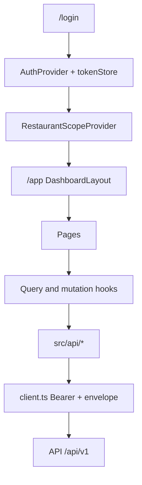
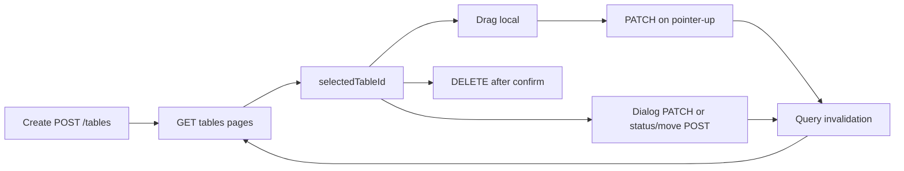
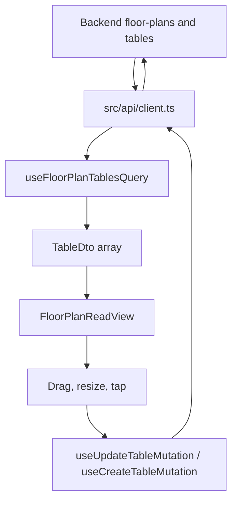

# Tavola Dashboard — Audit

**Repository:** `D:\Tavola`
**Date:** 22 September 2026
**Audience:** Project Manager, with technical depth for frontend, backend, and QA
**Evidence:** Source code, `docs/`, and `postman/TAVLA-API.postman_collection.json`. Backend runtime behavior that is not visible in this repository is marked **Backend Verification Required**.

This app is the restaurant dashboard. The platform-owner console is a separate product (`Tavola_platform`). In this app, `/platform` only shows a moved page.

## Contents

1. [PM executive summary](#part-1--pm-executive-summary)
2. [Repository and product overview](#part-2--repository-and-product-overview)
3. [Feature and module inventory](#2-feature-and-module-inventory)
4. [Frontend architecture](#3-frontend-architecture)
5. [API integration audit](#part-3--api-integration-audit)
6. [Floor map technical analysis](#part-4--floor-map-technical-analysis)
7. [CRUD and data integrity](#6-crud-and-data-integrity)
8. [Authentication and security](#7-authentication-authorization-and-security)
9. [Backend dependencies](#8-backend-dependencies)
10. [Performance](#9-performance-and-scalability)
11. [QA and testing](#10-qa-testing-and-reliability)
12. [UI and UX](#11-uiux-and-product-usability)
13. [Code quality](#12-code-quality-and-engineering-standards)
14. [Risk register](#13-risk-register)
15. [Roadmap](#14-development-roadmap)

---

# Part 1 — PM executive summary

## 1. What is already implemented

Staff can sign in, stay signed in across a refresh, pick a restaurant and branch, and work inside that scope.

Live, API-backed modules:

- Login, logout, password reset, session refresh, current user, profile and preferences.
- Restaurant and branch records, settings, working hours, gallery.
- Organization team: members, invitations, role change, ownership transfer (Settings).
- Reservations: today’s list, detail, create (including staff phone/walk-in), approve, reject, cancel, reschedule, complete, no-show, table-ready. Calendar is a date view of the same reservation data.
- Floor plans: list, create, activate. Tables: list, create, update, move between plans, status, delete, merge, split.
- Floor map: place, drag, resize, snap, zoom, auto-place unplaced tables. Changes save when the pointer is released.
- Menu, offers, reviews, messaging, notifications, analytics/reports, branches.

English and Arabic (including right-to-left layout) are both required and present in the translation files.

## 2. What is only partly implemented

| Area | What staff see | What is missing |
| --- | --- | --- |
| Waitlist | Join, promote, and cancel work | There is no server list. The board lives in this browser tab only (`sessionStorage`). Another device, or a refresh in a new tab, does not show the same queue. |
| Staff | Invite and “manage by id” | There is no employee directory. Managers must paste an employee id and a role id. |
| Floor map | Tables on a canvas | No rooms/sections API. No floor-plan rename or delete. Structural table status (Available / Occupied / Cleaning / Disabled) is not the same as “booked for 8pm”. |
| Calendar | Daily / weekly / monthly reservation grid | It is not a separate calendar product. Hours shown are 10:00–23:00 only. |
| Dashboard home | Analytics cards plus a reservation list | Some home widgets still depend on which reservation list the signed-in role is allowed to see. |

## 3. What is missing

- A real waitlist board from the server.
- An employee roster (list people, then act on them).
- Floor sections/rooms as saved data.
- Rename or delete a floor plan (no client functions exist).
- Reservation “reserved table” coloring on the map (`Reserved` is not a live table status).
- End-to-end browser tests. Automated tests cover the API client, auth, inventory helpers, and floor geometry — not full staff journeys.
- The old visual floor designer (`FloorDesigner`, `FloorMapCanvas`) is still in the repo but **no page mounts it**. It would save a private layout in the browser, not the restaurant’s real tables. Do not treat it as the product.

## 4. How the dashboard works today

1. Staff open `/login` and receive an access token (kept in memory) and a refresh token (kept in `localStorage`).
2. The app loads who they are and which restaurants and branches they can open.
3. The header selection is the working restaurant and branch. API paths use those ids. The app does not send a separate “tenant override”.
4. Pages load data through a shared HTTP client and a cache (TanStack Query). Buttons that change data call the same client, then refresh the relevant lists.
5. Hiding a button is convenience only. The server still decides whether the action is allowed.

## 5. How the floor map works today

A floor plan is a named layout for one branch. The first plan created for a branch becomes active automatically. Opening a plan does **not** make it the active plan; activation is a separate button.

Tables belong to one plan. Position is a box: X, Y, width, height, rotation, shape (rectangle or round), and capacity. The canvas uses CSS pixels, origin at the top-left, and does not mirror in Arabic.

Staff with Owner or Admin role can drag a table. The new position is sent only when they let go. If the save fails, they see an error and the next reload shows the last successful server position.

There are no saved sections. Indoor / VIP / smoking are flags on the table, not rooms on the map.

## 6. Most important API concerns

- **Waitlist and staff have no list endpoints in this client.** The UI works around that. Confirm with the backend whether list APIs now exist; if they do, the screens are behind the contract.
- **Docs disagree with code in a few places.** `docs/API_INTEGRATION.md` still says the refresh token is in `sessionStorage` and that merge/split are “not live”. The code stores the refresh token in `localStorage` and the Tables page calls `POST /tables/merge` and `POST /tables/:id/split`. **Backend Verification Required** for merge/split on the current API.
- **Floor-plan update and delete are not implemented** in `src/api/floorPlans.ts` (only list, create, activate).
- **Moving a table on the canvas uses Update Table**, not the Move endpoint. Move is “put this table on another floor plan”.

## 7. Most important usability concerns

- Staff management asks for raw ids. Managers will not know those ids.
- Waitlist looks like a shared board but is local to the browser.
- Two floor UIs exist in the codebase. Only one is on the Floor Plan page. Leaving the unused designer in the repo invites the wrong feature to be “finished”.
- Calendar hour labels are hardcoded English (“10 AM”), and the grid starts at 10:00.
- Inventory editing is limited to organization Owner and Admin. Employees who only have a permission slug still get blocked in the UI. That matches the current comment in `useCanManageInventory`, but it should be confirmed with product: is branch staff supposed to edit the floor?

## 8. Biggest risks

| Risk | Why it matters |
| --- | --- |
| Refresh token in `localStorage` | A script injected into the dashboard can read the long-lived token. Access tokens are safer (memory only). |
| Waitlist not shared | Hosts on two devices will double-seat or lose the queue. |
| Staff by pasted id | Wrong id changes the wrong person. No directory means no safe review before the action. |
| Table status vs reservation | “Occupied” on the map is a manual flag. It does not mean the table is booked. Staff can misread the floor during service. |
| Stale docs | Engineers following `API_INTEGRATION.md` or `ARCHITECTURE.md` can implement the wrong storage or skip merge/split. |

## 9. What to fix before more features

1. Decide waitlist: either a real list API and a shared board, or remove the impression that the board is shared.
2. Decide staff: a roster API, or stop asking managers to paste ids.
3. Align documentation with `tokenStore.ts` and the Tables merge/split calls.
4. Confirm merge/split, floor-plan rename/delete, and employee list with the backend team.
5. Remove or clearly quarantine the unused floor designer so the next sprint does not build on `localStorage`.

## 10. What the backend team must verify

- Does `GET` waitlist for a branch exist?
- Does `GET` employees for a restaurant exist?
- Are `POST /tables/merge` and `POST /tables/:tableId/split` deployed and stable?
- Can a floor plan be renamed or deleted? What happens to its tables?
- Which organization roles may edit tables? Is Employee always forbidden?
- Is table geometry in CSS pixels the agreed unit for the guest app?

## 11. What to prioritize next

**Phase 1:** Waitlist truthfulness, staff roster (or hide unsafe id forms), doc/contract alignment, refresh-token storage decision.  
**Phase 2:** Floor-plan rename/delete if the API exists; reservation-aware table coloring only after the backend defines it.  
**Phase 3:** Delete or isolate the unused designer; add browser tests for login, reservation action, and floor drag-save-reload.

---

# Part 2 — Repository and product overview

## 1. Repository discovery and project overview

### Stack

| Item | Evidence |
| --- | --- |
| Language | TypeScript (strict), React 19 |
| Build | Vite (`package.json` scripts `dev`, `build` = `tsc -b && vite build`) |
| Routing | React Router 7 (`src/App.tsx`) |
| Server cache | TanStack Query 5 (`AppQueryProvider`) |
| Style | Tailwind v4, `src/index.css` |
| Charts | Recharts (reports/dashboard) |
| Motion | GSAP on the marketing landing page; Three.js is a dependency (landing), not the floor map |
| Tests | Vitest, Testing Library, happy-dom, MSW (`npm test`) |
| Lint | oxlint (`npm run lint`) |
| i18n | `src/i18n/en.ts`, `src/i18n/ar.ts` |

### What this product is

Tavola Dashboard is the **restaurant operations web app** for a multi-tenant reservation platform. Restaurant owners, organization admins, and branch staff use it to run reservations, tables, menus, guests messages, and reports for the restaurant and branch they have selected.

It is not the platform-owner console. That console lives in `Tavola_platform`. This app’s `/platform` route is `PlatformMovedPage`.

### Who it is for

- Organization **Owner** and **Admin**: restaurants, branches, floor plans, tables, team, settings.
- **Employees**: the screens their JWT permissions and org role allow. Inventory mutations in the UI are limited to Owner/Admin (`useCanManageInventory` in `src/hooks/usePermissions.ts`). The server remains the real gate.
- Guests do not use this app. There is a public landing page and an invitation accept page.

### Business problem

Give a restaurant one place to take and manage bookings, see the room, keep the menu and offers current, answer reviews and messages, and read basic performance — without each restaurant inventing its own tools.

### How the pieces connect

Identity (who you are), tenant (inside the JWT), selected restaurant, and selected branch are four different things. The client does not send a tenant override.

### Entry points

- `src/main.tsx` mounts providers: theme, locale, auth, query client, restaurant scope, toasts, sidebar, then the router.
- Routes in `src/App.tsx`:
  - `/` landing
  - `/login` public
  - `/invite/:token` accept invitation
  - `/platform/*` moved notice
  - `/app/*` protected shell

Protected routes require a session. Unauthenticated users go to login. The exact guard component is `ProtectedRoute` / `PublicRoute` in the app tree.

### Environment

`.env.example`:

- `VITE_API_BASE_URL` (typically `/api/v1`)
- `VITE_DEV_API_PROXY_TARGET` (example host `https://api.tavola.business`)
- `VITE_PLATFORM_APP_URL` optional
- `VITE_ONESIGNAL_APP_ID` optional

No secrets belong in the report. Do not commit `.env.local`.

### Documentation

`docs/` is the frontend rule set (`ARCHITECTURE.md`, `API_INTEGRATION.md`, `AUTH_AND_RBAC.md`, `DECISIONS.md`, and others). Several files are **behind the code** (React Query, calendar, refresh-token storage, merge/split). Treat `src/api` and the pages as the runtime truth, then fix the docs.

### Feature status at a glance

| Module | Route | Status |
| --- | --- | --- |
| Landing | `/` | Present (marketing) |
| Login and session | `/login` | Live API |
| Invitation | `/invite/:token` | Live API |
| Home | `/app` | Live analytics + reservations |
| Reservations | `/app/reservations`, `/app/reservations/:id` | Live API |
| Calendar | `/app/calendar` | Live reservation query, custom grid |
| Floor plan | `/app/floor-plan` | Live API canvas |
| Tables | `/app/tables` | Live API including merge/split calls |
| Waitlist | `/app/waitlist` | Mutations live; list is browser session only |
| Walk-in | `/app/walk-in` | Staff reservation create |
| Menu | `/app/menu` | Live API |
| Gallery | `/app/gallery` | Live API |
| Offers | `/app/offers` | Live API |
| Reviews | `/app/reviews` | Live API |
| Messaging | `/app/messaging` | Live API |
| Notifications | `/app/notifications` | Live API |
| Reports | `/app/reports` | Live analytics |
| Branches | `/app/branches` | Live API |
| Staff | `/app/staff` | Invite and manage-by-id; no roster |
| Settings | `/app/settings` | Profile, org team, restaurant settings |
| Platform | `/platform` | Redirect/notice only |

Mock data and `RestaurantContext` are **not** referenced under `src/` (search found no `mockData` or `RestaurantContext`). Operational pages are not running on the old demo dataset.

---

## 2. Feature and module inventory

### Dashboard overview

- **Purpose:** Today’s picture for the selected restaurant/branch.
- **Route:** `/app`
- **UI:** `src/pages/Dashboard.tsx`, stat cards, shortcuts, live service bar.
- **Data:** `useReservationSummaryQuery`, `useOrgReservationSummaryQuery`, `useMyReservationsQuery`, unread notification count.
- **States:** skeletons and `ErrorState` exist on this page.
- **Limits:** Numbers are only as good as the analytics endpoints and the reservation list the role can see.

### Restaurant and branch management

- **Purpose:** Create and edit restaurants and branches, hours, gallery, cuisine/occasion tags.
- **Routes:** `/app/branches`, settings sections, scope switcher in the header.
- **API:** `src/api/restaurants.ts`, `src/api/branches.ts`, `src/api/taxonomy.ts`.
- **Users:** Owner/Admin for structural edits.
- **Limits:** Deleting a restaurant or branch that still has reservations is a server rule. **Backend Verification Required** for the exact error code the UI should show.

### Organization and team

- **Purpose:** Members, invitations, role change, remove member, transfer ownership, subscription/usage.
- **Route:** `/app/settings` (team) and `/invite/:token`.
- **API:** `src/api/organizations.ts`.
- **Users:** Owner/Admin. Ownership transfer is destructive and should stay behind a confirm dialog (verify the settings screen still uses `ConfirmDialog` before release).

### Users and account

- **Purpose:** The signed-in person updates name, preferences, avatar, password, sessions.
- **API:** `src/api/users.ts`, `src/api/auth.ts`.
- **This is not** “create a login and password for an employee” as a generated secret. Employee onboarding is **invite** (`inviteEmployee`), then the person accepts. The staff form asks the manager to type a **role id**.

### Roles and permissions

- UI helpers: `useHasPermission`, `useHasOrgRole`, `useCanManageInventory`, `useCanEditFloorLayout` (`src/hooks/usePermissions.ts`).
- Inventory buttons use Owner/Admin, not the permission slug alone.
- `useCanEditFloorLayout` also allows `tables:manage`, but the floor page gates mutations with `useCanManageInventory`. An employee with only `tables:manage` may still see a read-only map. **Confirmed** by which hook `FloorPlan.tsx` imports (`useCanManageInventory`).

### Authentication

See [Authentication and security](#7-authentication-authorization-and-security). Routes: `/login`, protected `/app`.

### Reservations

- **Purpose:** See bookings, open one, create one, run the lifecycle.
- **Routes:** `/app/reservations`, `/app/reservations/:id`, plus calendar and walk-in.
- **API:** `src/api/reservations.ts` — availability, create (idempotency key), list mine, list by branch and date window, get, approve, reject, cancel, reschedule, complete, no-show, table-ready.
- **Users:** Staff who pass the server’s reservation permissions. Branch list 403 falls back to the ownership list (documented in `API_INTEGRATION.md`).
- **Limits:** The map does not show these bookings on tables.

### Calendar

- **Purpose:** Daily, weekly, and monthly view of reservations.
- **Route:** `/app/calendar`
- **API:** `useCalendarRangeReservationsQuery` (same reservation endpoints, date range).
- **Limits:** Grid hours are 10 through 23 (`HOURS` in `Calendar.tsx`). Hour labels are English strings (`formatHourLabel`), not i18n keys. `INTEGRATION_STATUS.md` is wrong when it says the calendar was removed.

### Tables

- **Purpose:** Tabular inventory: create, edit, status, move between plans, delete, merge, split.
- **Route:** `/app/tables`
- **API:** `src/api/tables.ts` via `useInventoryQueries` / `useInventoryMutations`.
- **Validation:** Table number trimmed; status transitions limited in `allowedTableStatusTransitions`.
- **Risk:** Merge/split are implemented in the UI while `API_INTEGRATION.md` says they are not live. **Backend Verification Required.**

### Floor map

Full write-up: [Part 4 — Floor map technical analysis](#part-4--floor-map-technical-analysis).

- **Route:** `/app/floor-plan`
- **Purpose:** See and edit table boxes on the selected floor plan.
- **No sections API.**

### Menu, gallery, offers, reviews, messaging, notifications, reports

Each has a page under `src/pages/` and a module under `src/api/` (`menus.ts`, restaurant gallery, `offers.ts`, `reviews.ts`, `messaging.ts`, `notifications.ts`, `analytics.ts`). They are wired through hooks, not mock arrays.

- **Menu:** categories, items, options, add-ons, images, reorder, availability. Largest CRUD surface.
- **Gallery:** restaurant images.
- **Offers:** draft and publish.
- **Reviews:** staff list, reply, delete, images. Guest “write a review” is out of scope for this app (`INTEGRATION_STATUS.md`).
- **Messaging:** inbox, thread, send (including multipart), read, close.
- **Notifications:** list, unread badge, mark read, mark all. Broadcast exists in the client for privileged use.
- **Reports:** analytics date ranges (reservation summary, trends, peak hours, waitlist analytics, review summary).

### Waitlist

- **Route:** `/app/waitlist`
- **API used:** `joinWaitlist`, `promoteWaitlistEntry`, `cancelWaitlistEntry` (`src/api/waitlist.ts`).
- **List:** `sessionStorage` key `tavola-waitlist-session` (`Waitlist.tsx`). Not shared across staff or devices.
- **Status:** Partial. Dangerous if hosts treat it as the real queue.

### Staff

- **Route:** `/app/staff`
- **API used:** invite, assign role, assign branch, remove branch, remove (`src/api/employees.ts`).
- **No list function.** The manage section asks for employee id, role id, and branch id in text fields (`Staff.tsx`).
- **Status:** Partial. High operational risk.

### Settings and profile

- **Route:** `/app/settings`
- **Covers:** current user, password, sessions, organization team, restaurant/branch settings depending on the page sections.
- **Search/pagination:** list endpoints that are paginated use `page` and `limit`. There is no single global search across the product.

### Explicitly not in this app

Customer discovery, favorites, platform-admin CRUD, Prometheus, customer review submit. Stated as out of scope in `INTEGRATION_STATUS.md` and confirmed by the absence of those calls in `src/api` (platform admin lives in the other repo).

---

## 3. Frontend architecture

### Components

- `src/components/ui/*`: Button, Card, Input, Modal, ConfirmDialog, DataTable, EmptyState, ErrorState, Skeleton, PageHeader, StatusBadge, FilterBar, Badge.
- `src/components/layout/*`: sidebar, header, dashboard shell, quick actions.
- `src/components/floor/*`: production map pieces, plus an unused `designer/` tree.
- `src/components/inventory/*`: floor-plan and table dialogs.
- Pages in `src/pages/*` should stay thin. Several pages (Staff, Waitlist, Calendar) still contain form and session logic. That is maintainable today and will get worse if those screens grow without moving rules into hooks.

**Duplicate floor implementations:** production DOM map vs unused designer. This is the main structural smell.

### State

| Kind | Where |
| --- | --- |
| Session | `AuthContext` + `tokenStore` |
| Restaurant/branch selection | `RestaurantScopeContext` |
| Server data | TanStack Query hooks |
| Locale, theme, toasts, sidebar | Their contexts |
| Floor selection and drag | Local `useState` on the page and read view |
| Waitlist board | `useState` + `sessionStorage` |
| Unused designer | `FloorDesignerContext` + `localStorage` |

Stale data: query invalidation after mutations is the intended sync. A full-replace table PATCH can still clobber another user’s edit (see floor report). Waitlist state is stale by design relative to the server.

### Routing

Sidebar (`src/components/layout/Sidebar.tsx`) links dashboard, reservations, calendar, floor plan, waitlist, walk-in, menu, gallery, offers, reviews, tables, messaging, notifications, staff, reports, branches, settings.

Public: `/`, `/login`, `/invite/:token`.  
Protected: `/app/*`.  
Unauthorized API calls surface as `ApiError` (often 403). The route guard does not know every permission; it knows whether you are signed in.

### Forms and validation

No shared schema library is the center of the app (no single zod/react-hook-form mandate visible as the only form path). Screens use controlled inputs and dialogs.

- Required fields are enforced per dialog (table number, floor-plan name, invite name/email).
- Reservation create uses an idempotency key so a retry does not double-book as easily.
- Destructive actions: table delete uses `ConfirmDialog`. Other deletes should be checked screen by screen before calling the product “consistent”.
- Unsaved-changes prompts: not a global pattern. Leaving the floor mid-drag drops the unsaved pointer position because save is on pointer-up; if they navigate mid-request, the request may still finish.

### UI and UX engineering

**Works:** shared page header, empty and error components, toasts, English/Arabic files, floor canvas that does not mirror in RTL, status badges, skeletons on the home page.

**Problems:**

| Issue | Evidence | Improvement |
| --- | --- | --- |
| Staff ids | `Staff.tsx` text fields for ids | Replace with a roster picker when a list API exists |
| Waitlist looks shared | Session storage board | Label it as this-browser-only, or load a server list |
| Calendar hours in English | `formatHourLabel` returns `"10 AM"` | Use locale formatting, same as reservation times |
| Two floor systems | Designer unused | Remove it so design and QA have one map |
| Floor on a phone | Minimum world 960×640 | Default zoom-to-fit; do not promise phone editing |
| Generic floor error | `catch { setRepositionError(t.floorPlan.repositionFailed) }` | Show the server message/code |
| Inventory hidden from employees | `useCanManageInventory` | Product decision: document it in the UI (“Only an owner or admin can edit the floor”) |

Accessibility: buttons and dialogs exist; a full keyboard audit of the floor canvas was not executed. Drag-and-drop has no keyboard alternative on the canvas (inspector can still edit via dialogs). That is a real gap for keyboard-only users.

---

## 4. API integration and data flow

The full table is in [Part 3 — API integration audit](#part-3--api-integration-audit).

Summary for the PM:

- One HTTP client attaches the bearer token, unwraps the envelope, and refreshes once on expired access.
- Every live module listed in section 2 calls that client. There is no parallel mock API in `src/`.
- The serious holes are **missing list operations** the UI needs (waitlist, employees) and **doc drift** (merge/split, token storage, calendar).
- Floor geometry is `PATCH /tables/:id`, not “save layout”.
- Moving a table to another plan is `POST /tables/:id/move`.

---

## 5. Floor map and tables

See [Part 4 — Floor map technical analysis](#part-4--floor-map-technical-analysis) for the lifecycle, field table, API table, and weakness list.

PM version: the Floor Plan page draws server tables as boxes. Dragging saves when you let go. Plans can be created and activated. They cannot be renamed or deleted in this client. Rooms are not saved. An old designer in the repo saves to the browser only and is not on the page.

---

## 6. CRUD and data integrity

| Entity | Create | Read | Update | Delete | Integrity notes |
| --- | --- | --- | --- | --- | --- |
| Session | Login | `/users/me` | Password, profile | Logout, revoke session | Refresh in localStorage |
| Restaurant | POST | List/get | PATCH | DELETE | Scope must reload after create |
| Branch | POST | List/get | PATCH | DELETE | Hours are a separate call |
| Floor plan | POST `{name}` | GET items | Activate only | **Missing in client** | First plan becomes active |
| Table | POST | Paged GET, walked by helper | PATCH full body | DELETE 204 | Ids from server; numbers `T{n}` from client |
| Table plan | — | — | POST move | — | Not the same as drag |
| Table status | — | on the DTO | POST status | — | Not a booking |
| Merge group | POST merge | `mergeGroupId` | — | POST split | Verify server |
| Reservation | POST + idempotency | List/get | Domain POSTs | Cancel action | No generic update |
| Waitlist entry | POST join | **Local only** | Promote | Cancel | Lost when storage is cleared |
| Employee | POST invite | **No list** | Role/branch by id | Remove by id | Wrong id is silent damage until the server rejects |
| Menu item | POST | GET tree | PATCH | DELETE | Reorder endpoints exist |
| Offer | POST | GET | PATCH | DELETE | Publish is its own call |
| Review reply | POST reply | GET | — | DELETE review | Staff side |
| Message | POST | GET | Read/close | — | — |
| Org member | Invite | GET members | Change role | Remove | Transfer ownership is high impact |

**Usernames and passwords:** this dashboard does not generate employee passwords in the staff page that was read. Invite sends name, email, phone, and a role id. If a temporary password were ever generated in the browser, that would be a security defect; it is not the current staff flow.

**Duplicate prevention:** reservation idempotency key; table numbers checked only against the loaded list; unique constraint is the server’s job.

**Confirmations:** table delete is confirmed. Managers should confirm the same pattern on restaurant delete, member remove, and ownership transfer during QA (those dialogs were not all re-read line by line in this pass).

---

## 7. Authentication, authorization, and security

| Topic | Behavior |
| --- | --- |
| Login | `POST /auth/login` |
| Logout | `POST /auth/logout` and logout-all |
| Access token | Memory only. Lost on full reload until refresh runs |
| Refresh token | `localStorage` (`tavla-refresh-token`) |
| Refresh | Single-flight `POST /auth/refresh` on `AUTH_EXPIRED_TOKEN` |
| Current user | `GET /users/me` after tokens exist |
| RBAC | JWT org role and permission slugs for **hiding** buttons |
| 403 | Server wins; UI should show the error, not retry forever |
| Password | Change/reset through auth API; not logged by policy (`CLAUDE.md`) |

**Risk:** refresh token in `localStorage` is readable by any script that runs on the origin. The project’s own security note prefers memory for the access token. The refresh token is the long-lived secret. Moving it to an httpOnly cookie would be a **backend** change. Until then, treat XSS as a session-theft bug.

**Not found:** hardcoded production passwords in the files read for this audit. `.env.example` contains a public API host, not a password.

**Platform vs restaurant tokens:** a platform-admin token is a different login (`POST /platform-admin/login` in the other app). Do not reuse it against `/users/me`.

---

## 8. Backend dependencies

The dashboard needs these server concepts:

- User, session, organization membership and role
- Restaurant, branch, working hours, gallery, taxonomy links
- Floor plan, table (geometry + structural status + merge group)
- Reservation and its action endpoints
- Waitlist **commands** (join, promote, cancel); list is not consumed
- Employee **commands**; roster is not consumed
- Menu tree, offers, reviews, conversations, notifications, analytics aggregates

Relationships the UI assumes:

- Branch belongs to restaurant.
- Floor plan belongs to branch.
- Table belongs to branch and one floor plan.
- Reservation is queried by owner or by branch and date. It is **not** joined to table geometry in the floor page.
- Employee actions are by id, scoped by restaurant path on invite.

**Schema mismatch risk (confirmed in types):** there is no `section` field on `TableDto`. Any design that shows rooms is ahead of the DTO.

**Backend verification list:** waitlist list, employee list, floor-plan PATCH/DELETE, merge/split deployment, pixel coordinate contract with the guest app, role required for table edits.

---

## 9. Performance and scalability

| Topic | Observation | Impact | Improvement |
| --- | --- | --- | --- |
| Table fetch | `listAllTablesByFloorPlan` loops pages of 100, max 50 pages | A huge branch downloads every table before paint | Virtualize only if branches exceed a few hundred tables; otherwise acceptable |
| Auto-place | One PATCH per table, sequential | Slow on a full unplaced set | One batch endpoint, or parallel with a concurrency cap |
| Drag | No network during pointer move | Good | Keep it |
| Re-renders | Drag state sits in the read view | Acceptable for dozens of tables | If a plan exceeds ~200 tables, profile glyph re-renders |
| Cache | TanStack Query | Avoids refetch on every navigation when keys match | Keep scope ids in the query key (already the pattern) |
| Bundle | Three.js and GSAP ship for the landing experience | Larger than the dashboard needs if they share one bundle | Confirm Vite splits the landing route (**not verified** in this audit) |
| Listeners | Pointer handlers should detach on pointer-up | Leak if a handler survives unmount | Code review of `FloorPlanReadView` cleanup on unmount during an active drag |
| Search | No server typeahead on staff | N/A until a roster exists | — |

Pagination is implemented for tables. It is not “missing”; the floor **chooses** to walk pages so the map is complete.

---

## 10. QA, testing, and reliability

### What exists

13 test files under `src/`:

- API: `client.test.ts`, `auth.test.ts`, `reservations.test.ts`, `floorPlans.tables.test.ts`, `restaurants.branches.test.ts`, `menus.normalize.test.ts`
- UI/logic: `FloorPlanReadView.test.tsx`, `floorGeometry.test.ts`, `useInventoryMutations.test.tsx`
- Auth/scope: `AuthContext.test.tsx`, `RestaurantScopeContext.test.tsx`, `accessTokenClaims.test.ts`, `scopeSelection.test.ts`

No Playwright/Cypress suite was found in the test glob (`*.test.ts(x)` only).

### Missing cases that matter

- Login failure and expired refresh
- Employee invite and the by-id manage form (wrong id)
- Waitlist: second browser does not see the first browser’s queue
- Floor: drag, failed PATCH, reload shows old position
- Floor: activate plan B does not move the tables of plan A
- Reservation approve/reject/cancel from the detail page
- Merge/split against a real or mocked contract
- Arabic RTL: floor coordinates stay put
- 403 on branch reservations shows the fallback banner

### QA checklist (priority order)

1. Login, refresh after reload, logout, logout-all.
2. Wrong password and locked-account code shown to the user.
3. Switch restaurant and branch; lists change; no data from the previous branch remains.
4. Create reservation (walk-in) once; double-click does not create two.
5. Open reservation; each lifecycle button; reload shows the new status.
6. Calendar day matches the reservation list for that date.
7. Create floor plan; first one active; second one viewed but not active until Activate.
8. Create table on the canvas; refresh; box is still there.
9. Drag; kill the request (offline); error visible; refresh shows the old box.
10. Delete table with confirm; it disappears after refresh.
11. Merge two available tables and split (only if backend confirms the routes).
12. Waitlist join on browser A; browser B is empty (document as current behavior).
13. Staff invite; refuse to test “remove” until a roster exists, except in a sandbox id.
14. Menu item create and availability toggle.
15. Notification mark-all clears the badge.
16. Arabic layout: sidebar, dialogs, floor not mirrored.
17. Narrow viewport: shell usable; floor scrolls.

---

## 11. UI/UX and product usability

| Persona | What will confuse them | Change |
| --- | --- | --- |
| Owner | Floor plan vs active floor plan | The picker already appends the active label, and Activate shows only when the selected plan is not active (`FloorPlan.tsx`). Keep that visible in QA |
| Manager | Staff page ids | Do not ship id paste as the long-term UX |
| Host | Waitlist | Say “Saved on this device only” until the API lists entries |
| Host | Occupied vs booked | Legend: “Status is set by staff. It is not today’s reservations.” |
| PM | Designer files in the repo | One floor feature in the roadmap |

Other concrete issues: calendar hour copy is English-only; floor errors hide the server reason; no undo after a bad drop; phone layout is a scrolled 960px board.

Do not redesign the visual system. The shared UI kit is already the product language.

---

## 12. Code quality and engineering standards

**Strong:** typed API modules, one client, path alias `@/`, query hooks for server state, floor geometry unit-tested, domain actions kept off generic PATCH, i18n files in pairs, envelope errors as `ApiError`.

**Weak:**

- Dead floor designer and `FloorMapCanvas` (unused export).
- Docs drifted (`ARCHITECTURE.md`, `API_INTEGRATION.md`, `INTEGRATION_STATUS.md`).
- Staff and waitlist pages own business rules that will be copied if a second screen needs them.
- `updateTable` always sends a full body with defaults (`shape ?? 'Rectangle'`, `indoor ?? true`). A partial mental model in the UI can still overwrite flags if the in-memory table was incomplete.
- Test gap on journeys.
- Dependency weight (Three, GSAP) for non-dashboard surfaces.

**High-risk files for the next change:** `src/pages/FloorPlan.tsx`, `src/api/tables.ts`, `src/pages/Staff.tsx`, `src/pages/Waitlist.tsx`, `src/api/tokenStore.ts`.

---

## 13. Risk register

Severity reasons are in the last column’s spirit: Critical means data loss, broken core flow, or an easy account takeover. High means a manager can do the wrong thing or the feature lies. Medium means cost, confusion, or a real bug with a workaround. Low means polish.

| ID | Area | Issue | Evidence | Severity | Business impact | Recommended fix | Team | Dependencies |
| --- | --- | --- | --- | --- | --- | --- | --- | --- |
| R1 | Security | Refresh token in localStorage | `tokenStore.ts` lines 4–9 and 35–46 | High | Stolen refresh token stays logged in as the user | httpOnly cookie or equivalent; until then strict XSS hygiene | Both | Auth design |
| R2 | Waitlist | Board is not shared | `Waitlist.tsx` `SESSION_STORAGE_KEY` | High | Double seating, lost queue | Server list, or honest UI copy | Both | List endpoint **Backend Verification Required** |
| R3 | Staff | Actions by pasted id, no roster | `Staff.tsx`, `employees.ts` has no list | High | Wrong person removed or reassigned | Roster API and pickers | Both | List endpoint **Backend Verification Required** |
| R4 | Floor | Unused designer can be mistaken for the product | No page imports `FloorDesigner`; `saveFloorDocument` uses localStorage | High | Layout “saved” but guest app never sees it | Delete or quarantine | Frontend | None |
| R5 | Floor | Table status is not reservation state | `TableStatusDto`; floor page does not load reservations | High | Hosts misread the room | Legend now; overlay later | Both | Availability-by-table API |
| R6 | Floor | Full-body PATCH last-write-wins | `updateTable` sends all profile fields | High | Silent overwrite of capacity or flags | Conflict check on `updatedAt` | Both | API support |
| R7 | Contract | Docs say merge/split are not live; UI calls them | `API_INTEGRATION.md` vs `Tables.tsx` | Medium | QA skips or files false bugs | Confirm API, then fix the doc | Both | **Backend Verification Required** |
| R8 | Contract | Docs say refresh is sessionStorage; calendar “removed” | `API_INTEGRATION.md`, `INTEGRATION_STATUS.md`, `App.tsx` | Medium | Wrong implementation next sprint | Update docs in the same change as behavior | Frontend | None |
| R9 | Floor | No plan rename/delete | `floorPlans.ts` only list, create, activate | Medium | Clutter, cannot undo a bad name | Add routes only if they exist | Both | **Backend Verification Required** |
| R10 | Floor | Manual drag allows overlap | `overlaps` used by auto-place only | Medium | Ambiguous map | Block or warn on drop | Frontend | None |
| R11 | Floor | Auto-place stops mid-loop | `handleAutoPlace` | Medium | Half the tables placed, easy to miss | Summary of failures | Frontend | None |
| R12 | Floor | Reposition error hides API code | Empty `catch` in `persistGeometry` | Medium | Support cannot tell conflict from network | Surface `ApiError` | Frontend | None |
| R13 | i18n | Calendar hour labels English-only | `formatHourLabel` in `Calendar.tsx` | Medium | Arabic UI breaks the pattern | `Intl` or translation keys | Frontend | None |
| R14 | UX | Employees with `tables:manage` still cannot edit | Floor uses `useCanManageInventory` | Medium | Branch manager locked out, or correctly locked — unclear | Product copy + align hooks | Frontend + product | Role matrix |
| R15 | QA | No end-to-end tests | 13 unit/component tests only | Medium | Regressions on login and floor | Add a small browser suite for the checklist | Frontend | CI |
| R16 | Performance | Sequential PATCH on auto-place | `FloorPlan.tsx` loop | Low | Slow setup of a new room | Batch or parallel | Both | Optional API |
| R17 | A11y | Canvas drag has no keyboard path | Pointer drag in `FloorPlanReadView` | Medium | Some staff cannot move tables without a pointer | Nudge via inspector (size exists; position nudge should be checked) | Frontend | None |
| R18 | Integrity | Table number `T{n}` from loaded plan only | `nextTableNumber` | Medium | Duplicate number if another plan already uses `T3` | Use branch-wide list or server error | Frontend | Unique index |
| R19 | Product | No sections | No zone API in client | Medium | Cannot represent terrace as a region | New resource | Both | Product decision |
| R20 | Bundle | Landing 3D/GSAP in the same app | `package.json` dependencies | Low | Slower first load | Route-level split if not already | Frontend | Build check |

R1 is High rather than Critical because the access token is not in localStorage and theft still requires script execution on the origin. It becomes Critical if an XSS bug is found.

R2 and R3 are High rather than Critical because the commands themselves call the API; the failure is operational truth and safety, not a broken login.

---

## 14. Development roadmap

No time estimates. Order is dependency order.

### Phase 1 — Critical fixes

| ID | Description | Reason | Owner | Depends on | Priority | Acceptance |
| --- | --- | --- | --- | --- | --- | --- |
| P1.1 | Decide refresh-token storage with the backend | R1 | Both | Auth design | P0 | Access token stays memory-only; refresh is not readable by page script, or the risk is formally accepted and documented |
| P1.2 | Waitlist: server list or honest empty-state copy | R2 | Both | List API answer | P0 | Two browsers show the same queue, or the screen states it is device-local |
| P1.3 | Staff: stop raw-id management or add a roster | R3 | Both | List API answer | P0 | Manager selects a person by name; remove still confirms |
| P1.4 | Correct `API_INTEGRATION.md`, `INTEGRATION_STATUS.md`, stale `ARCHITECTURE.md` paragraphs | R7, R8 | Frontend | Merge/split confirmation | P0 | Docs match `tokenStore.ts`, calendar route, and Tables merge buttons |
| P1.5 | Quarantine unused floor designer | R4 | Frontend | None | P0 | No route can save `localStorage` as if it were the floor; README or ADR says the live map is `FloorPlanReadView` |

### Phase 2 — Core feature completion

| ID | Description | Reason | Owner | Depends on | Priority | Acceptance |
| --- | --- | --- | --- | --- | --- | --- |
| P2.1 | Floor-plan rename and delete if the API exists | R9 | Both | Backend routes | P1 | Rename survives refresh; delete explains what happens to tables |
| P2.2 | Confirm and test merge/split | R7 | Both | API | P1 | Two Available tables merge; split restores them; error shown if status forbids it |
| P2.3 | Reservation-aware floor only with a real contract | R5 | Both | Backend definition | P1 | No fake `Reserved` status in the client |
| P2.4 | Role copy for who may edit inventory | R14 | Frontend + product | Role matrix | P1 | Read-only users see why editing is unavailable. The plan picker already marks the active plan (`FloorPlan.tsx`) |

### Phase 3 — Data integrity and floor map

| ID | Description | Reason | Owner | Depends on | Priority | Acceptance |
| --- | --- | --- | --- | --- | --- | --- |
| P3.1 | Conflict-safe table update | R6 | Both | `updatedAt` or partial PATCH | P1 | Second editor gets a conflict message instead of a silent overwrite |
| P3.2 | Overlap warning on drop | R10 | Frontend | None | P2 | Dropping onto another table warns or rejects |
| P3.3 | Auto-place failure report | R11 | Frontend | None | P2 | User sees how many tables saved |
| P3.4 | Show API error on reposition | R12 | Frontend | None | P1 | Message includes server `code` when present |
| P3.5 | Branch-wide table number uniqueness in the UI | R18 | Frontend | Branch table list | P2 | Create uses numbers not already on the branch |
| P3.6 | Sections, only after a product decision | R19 | Both | New API | P2 | A section survives refresh and is not localStorage |

### Phase 4 — UX, performance, accessibility

| ID | Description | Reason | Owner | Depends on | Priority | Acceptance |
| --- | --- | --- | --- | --- | --- | --- |
| P4.1 | Calendar hours through locale | R13 | Frontend | None | P2 | Arabic and English hour labels |
| P4.2 | Keyboard nudge for table position | R17 | Frontend | None | P2 | Selected table moves with the keyboard and saves like a drop |
| P4.3 | Fit-to-screen default zoom | Phone usability | Frontend | None | P2 | A 390px-wide viewport shows the whole minimum board or a clear zoom control |
| P4.4 | Check landing code-splitting | R20 | Frontend | Build output | P3 | Dashboard entry does not needlessly include the 3D landing if the router can split it |

### Phase 5 — QA and production readiness

| ID | Description | Reason | Owner | Depends on | Priority | Acceptance |
| --- | --- | --- | --- | --- | --- | --- |
| P5.1 | Browser tests for checklist items 1, 5, 7, 8, 9 | R15 | Frontend | Stable API or MSW | P1 | CI fails if drag-save or login breaks |
| P5.2 | RTL pass on floor and dialogs | i18n rule | QA | None | P1 | Coordinates unchanged; labels translated |
| P5.3 | Error-code pass (401, 403, 409 duplicates) | Support | QA + frontend | Backend samples | P1 | Each code has a human string in `en` and `ar` |
| P5.4 | Monitoring note: failed PATCH and 401 refresh | Operations | Frontend | Hosting choice | P2 | No tokens in logs |

Suggested order: P1.4 and P1.5 immediately (no backend wait), P1.2 and P1.3 in parallel with the backend answers, P1.1 as a security decision, then P3.4, P2.2, P5.1.

---

# Part 3 — API integration audit

**App:** `D:\Tavola`  
**Client:** `src/api/client.ts` (`apiRequest` / `apiRequestWithMeta`)  
**Base URL:** `VITE_API_BASE_URL` (example: `/api/v1` with dev proxy `VITE_DEV_API_PROXY_TARGET`)  
**Auth header:** `Authorization: Bearer <access token>` when `tokenStore` has one  
**Envelope:** `{ success, message, data, meta }` — callers receive `data`  
**Date:** 22 September 2026

Contract references in-repo: `postman/TAVLA-API.postman_collection.json`, `docs/API_INTEGRATION.md`, `docs/INTEGRATION_STATUS.md`.  
If those docs disagree with `src/api/*.ts`, **the client code is what the dashboard actually calls**. Backend acceptance of each call is **Backend Verification Required** unless a test in this repo asserts it.

Platform-owner routes (`/platform-admin/*`) are not called by this app. `/platform` renders `PlatformMovedPage`.

---

## Client behavior (all modules)

| Concern | Implementation | Problem |
| --- | --- | --- |
| Access token | Memory only (`tokenStore.ts`) | Matches the security rule |
| Refresh token | `localStorage` key `tavla-refresh-token` (migrates from `sessionStorage`) | `docs/API_INTEGRATION.md` still says `sessionStorage`. XSS can read the refresh token |
| 401 `AUTH_EXPIRED_TOKEN` | One shared `POST /auth/refresh`, then one retry | Confirmed in `client.ts` `refreshSession` |
| 401 `AUTH_INVALID_TOKEN` | No refresh; session cleared | Documented in `API_INTEGRATION.md` |
| Other 401/403/404/500 | Thrown as `ApiError` (`code`, `message`, `status`) | Pages map some codes; not every screen uses the same mapper |
| Idempotency | `createIdempotencyKey` used for reservation create | Floor/table/menu creates do not send it |
| Pagination | `page`, `limit`, `total` via `PaginatedData` | Tables and several lists walk pages in helpers; some screens use one page |

---

## Integration table

Status key: **Live** = UI calls this function. **Client only** = function exists; confirm a screen uses it before treating it as a product feature. **Gap** = product screen exists but no list/update/delete in the client.

| Module | Frontend function | Method | Endpoint | Request | Response used | Status | Problems |
| --- | --- | --- | --- | --- | --- | --- | --- |
| Auth | `login` | POST | `/auth/login` | email, password | token pair | Live | — |
| Auth | `logout` | POST | `/auth/logout` | refresh token | 204 | Live | — |
| Auth | `logoutAll` | POST | `/auth/logout-all` | — | — | Live | — |
| Auth | `refreshSession` | POST | `/auth/refresh` | `{ refreshToken }` | new pair | Live | Token stored in localStorage |
| Auth | `forgotPassword` | POST | `/auth/forgot-password` | email | — | Live | — |
| Auth | `resetPassword` | POST | `/auth/reset-password` | token, password | — | Live | — |
| Auth | `changePassword` | POST | `/auth/change-password` | current, next | — | Live | Settings |
| Auth | `listSessions` / `revokeSession` | GET / DELETE | `/auth/sessions` | session id | session list | Live | Settings |
| Users | `getCurrentUser` | GET | `/users/me` | — | profile | Live | Bootstrap |
| Users | `updateCurrentUser` | PATCH | `/users/me` | profile fields | user | Live | — |
| Users | preferences get/update | GET / PATCH | `/users/me/preferences` | prefs | prefs | Live | — |
| Users | `uploadMyAvatar` | POST | `/users/me/avatar` | FormData | — | Live | multipart; no JSON content-type |
| Restaurants | list/get/create/update/delete | GET/POST/PATCH/DELETE | `/restaurants` and `/restaurants/:id` | restaurant body | restaurant | Live | Scope picker + settings. Who may create is role-gated in UI |
| Restaurants | settings, working hours | GET / PATCH | `/restaurants/:id/settings`, `.../working-hours` | settings or hours body | DTO | Live | `updateRestaurantSettings` and `updateRestaurantWorkingHours` |
| Branches | working hours | GET / PATCH | `.../branches/:id/working-hours` | hours body | hours | Live | `updateBranchWorkingHours` |
| Restaurants | gallery | multipart | `/restaurants/:id/gallery` | files | images | Live | — |
| Branches | list/get/create/update/delete | CRUD | `/restaurants/:id/branches` | branch | branch | Live | — |
| Floor plans | `listFloorPlans` | GET | `.../floor-plans` | — | `{ items }` | Live | No pagination |
| Floor plans | `createFloorPlan` | POST | `.../floor-plans` | `{ name }` | plan | Live | First plan auto-activates (server) |
| Floor plans | `activateFloorPlan` | PATCH | `.../floor-plans/:id/activate` | empty | plan | Live | — |
| Floor plans | update/delete | — | — | — | — | Gap | Not in `floorPlans.ts` |
| Tables | `listTablesByFloorPlan` / `listAllTablesByFloorPlan` | GET | `.../floor-plans/:id/tables` | page, limit | `TableDto[]` | Live | Cap 50 pages |
| Tables | `listTablesByBranch` | GET | `.../branches/:id/tables` | page, limit | tables | Live | Tables page |
| Tables | `getTable` | GET | `/tables/:id` | — | table | Client | Map uses the list |
| Tables | `createTable` | POST | `.../tables` | CreateTableRequest | table | Live | No status; no idempotency key |
| Tables | `updateTable` | PATCH | `/tables/:id` | full profile | table | Live | Not partial; drops `status` and `floorPlanId` |
| Tables | `deleteTable` | DELETE | `/tables/:id` | — | 204 | Live | — |
| Tables | `moveTable` | POST | `/tables/:id/move` | `{ targetFloorPlanId }` | table | Live | Plan change, not X/Y |
| Tables | `changeTableStatus` | POST | `/tables/:id/status` | `{ status }` | table | Live | Four statuses only |
| Tables | `mergeTables` | POST | `/tables/merge` | `{ tableIds, primaryTableId? }` | table | Live on Tables page | Doc says not live. **Backend Verification Required** |
| Tables | `splitTable` | POST | `/tables/:id/split` | — | table | Live on Tables page | Same |
| Reservations | `searchAvailability` | GET | `/reservations/availability` | branch, time, party | slots | Live | — |
| Reservations | `createReservation` | POST | `/reservations` | online body + idempotency | reservation | Live | — |
| Reservations | `createStaffReservation` | POST | `/reservations` | Phone/Walk-in + idempotency | reservation | Live | — |
| Reservations | `listMyReservations` | GET | `/reservations` | filters | page | Live | Ownership list |
| Reservations | `listBranchReservations` | GET | `.../branches/:id/reservations` | dateFrom, dateTo | page | Live | Employee path; 403 falls back |
| Reservations | `getMyReservation` | GET | `/reservations/:id` | — | reservation | Live | Detail route |
| Reservations | approve, reject, cancel, reschedule, complete, no-show, table-ready | POST | `/reservations/:id/...` | action body | reservation | Live | Domain actions, not a generic PATCH |
| Waitlist | `joinWaitlist` | POST | branch waitlist join | party, window | entry | Live | — |
| Waitlist | `cancelWaitlistEntry` | POST | cancel by id | — | — | Live | Id from this browser session |
| Waitlist | `promoteWaitlistEntry` | POST | promote by id | — | — | Live | — |
| Waitlist | list | — | — | — | — | Gap | Board stored in `sessionStorage` (`Waitlist.tsx`) |
| Employees | `inviteEmployee` | POST | invite | name, email, phone, role id | employee | Live | Role id is typed by hand |
| Employees | assign role, assign branch, remove branch, remove | POST/DELETE | employee routes | ids | employee | Live | All by pasted id |
| Employees | list roster | — | — | — | — | Gap | No function in `employees.ts` |
| Organizations | subscription, usage | GET | org subscription/usage | — | plan usage | Live | Settings |
| Organizations | members, change role, remove, transfer | GET/POST | org members | member id, role | members | Live | Owner/Admin |
| Organizations | invitations issue/revoke/accept | POST | invitations | email, token | invite | Live | Accept is `/invite/:token` |
| Menu | menus, categories, items, options, add-ons, images, reorder, feature, availability | CRUD | `/restaurants/:id/menus/...` | menu tree | DTOs | Live | Largest surface; see `menus.ts` |
| Offers | create, list, update, publish, delete | CRUD | offers paths | offer | offer | Live | `offers.ts` |
| Reviews | list, get, reply, delete, images | GET/POST/DELETE | restaurant reviews | reply text | review | Live | Staff reply, not guest submit |
| Messaging | list, get, messages, start, send, read, close | GET/POST | conversations | text or multipart | messages | Live | `messaging.ts` |
| Notifications | list, unread count, mark read, mark all, broadcast | GET/POST | notifications | — | items | Live | Broadcast is privileged |
| Notifications | OneSignal identity token | POST | identity-token | — | token | Live if `VITE_ONESIGNAL_APP_ID` set | No SDK in app; bootstrap hook only |
| Analytics | customer insights, reservation summary, trends, peak hours, waitlist, reviews, org summary | GET | analytics paths | date range | aggregates | Live | Dashboard + Reports |
| Taxonomy | cuisine and occasion categories | GET | taxonomy | — | categories | Live | Restaurant profile |
| Health | health, liveness, readiness | GET | `/health` etc. | — | non-envelope | Client | Not a staff page |

Exact path strings for menu, offers, reviews, messaging, analytics, and organization calls are in the matching `src/api/*.ts` file. This table names the operation the UI performs. A line-by-line Postman diff for every menu sub-resource was not re-executed in this audit; `docs/API_COMPATIBILITY_REPORT.md` is the generated matrix and may be older than `menus.ts`. **Backend Verification Required** if that report and `menus.ts` disagree.

---

## Confirmed mismatches (frontend vs its own docs)

| Topic | Doc | Code |
| --- | --- | --- |
| Refresh token storage | `API_INTEGRATION.md` says `sessionStorage` | `tokenStore.ts` writes `localStorage` |
| Merge / split | `API_INTEGRATION.md` “Not live” | `tables.ts` + `Tables.tsx` call them |
| Calendar removed | `INTEGRATION_STATUS.md` (2026-08-04) says calendar UI removed | `App.tsx` route `/app/calendar` and `Calendar.tsx` query reservations |
| React Query | `ARCHITECTURE.md` still says no React Query in an older section | `AppQueryProvider` and `use*Query` hooks are the data layer |
| Floor designer | Older notes describe `FloorDesigner` | Page uses `FloorPlanReadView` only |

These are documentation defects. They are not proof the backend lacks merge.

## Inferred from frontend code

- Waitlist and employee **list** endpoints are absent from `src/api`. The UI was built around that absence (`docs/API_INTEGRATION.md` hard limits). If the backend added them later, this app does not call them.
- Table geometry PATCH sends a full object. A concurrent edit can be overwritten.
- Reservation list depends on role: branch window vs `GET /reservations`, with a fallback banner on 403 (documented).

## Not claimed

This audit does **not** say the backend is missing an endpoint only because the dashboard never calls it. Floor-plan rename, waitlist list, and employee list are **unverified on the server**.

---

## UI actions that do not hit the API

| UI | What happens |
| --- | --- |
| Floor designer save | Not on a route. If mounted later, `saveFloorDocument` writes `localStorage` only |
| Waitlist board after refresh in a new session | Empty unless the same tab’s `sessionStorage` still has entries |
| Snap, zoom, selection | Local only, until drop/resize/create |
| Sidebar visibility | Local permission check; server still enforces |

## Mutations and cache

Inventory, reservations, menu, and similar hooks invalidate TanStack Query keys on success (see `src/hooks/*Mutations.ts`). Failed mutations do not write the error payload into the cached entity. The user sees a toast or inline `ApiError` message when the page maps it.

Double-submit: reservation create sends an idempotency key. Table create relies on the button’s pending state. **Inferred risk:** a double click before `isPending` flips can create two tables.

---

## Error handling gaps

- `persistGeometry` on the floor uses a generic “reposition failed” string and discards the `ApiError` code (`FloorPlan.tsx` empty `catch`).
- Staff and waitlist pages check `isApiError` and toast `err.message` in several branches (see those pages).
- 403 on branch reservations is a known fallback, not a crash.
- There is no global toast for every failed query; pages own `ErrorState` or inline text. Coverage is uneven. **Inferred** from the pattern, not from clicking every screen in this audit.

---

# Part 4 — Floor map technical analysis

**App:** `D:\Tavola` restaurant dashboard  
**Date:** 22 September 2026  
**Production path:** `src/pages/FloorPlan.tsx` → `src/components/floor/FloorPlanReadView.tsx` → `src/api/tables.ts` and `src/api/floorPlans.ts`.

The older designer (`src/components/floor/designer/*`, `src/context/FloorDesignerContext.tsx`, `src/components/floor/FloorMapCanvas.tsx`) is **not mounted by any page**. It persists a private document in `localStorage` (`tavola-floor-designer-${branchId}`). It is not the floor map staff use.

---

## A. Functional explanation

### 1. What the floor map represents

A **floor plan** is a named layout for one **branch**. Tables on that plan are drawn as boxes on a canvas. The map is an editing and viewing tool for inventory geometry. It is not a live seating chart tied to a reservation time.

### 2. How a floor plan is organized

- A branch can have many floor plans (`FloorPlanDto`: `floorPlanId`, `branchId`, `name`, `isActive`, timestamps).
- Exactly one plan is active for the branch after activation. The first plan created for a branch is auto-activated by the backend (documented in `createFloorPlan` and `docs/API_INTEGRATION.md`).
- The page remembers which plan the user is **viewing**. Viewing does not activate (`FloorPlan.tsx` file comment, lines 43–46).

### 3. Sections, rooms, areas

**Not implemented as saved data.**

There is no section resource in `src/api/floorPlans.ts`. `docs/API_INTEGRATION.md` states there is no FloorPlan PATCH and no zone API.

Table flags `indoor`, `vip`, and `smoking` exist on `TableDto`. They are properties of a table, not polygons on the canvas.

`FloorMapCanvas` groups mock-style `section` values (indoor, terrace, vip, …). That component is unused by the Floor Plan page.

### 4. How tables are created

Owner/Admin (`useCanManageInventory`) can:

- Open **Create table** (`TableFormDialog`) and post a full body, or
- Pick a size preset on the toolbar and tap the canvas (`handlePlaceAt` in `FloorPlan.tsx`).

Preset create sends `floorPlanId`, generated `tableNumber` (`T1`, `T2`, … via `nextTableNumber`), `capacity`, `shape`, `positionX`, `positionY`, `width`, `height`, `rotation: 0`, `indoor: true`, `vip: false`, `smoking: false`, `layer: 0`.

Create always starts as status `Available`. The client never sends `status` on create (`CreateTableRequest` comment in `tables.ts`).

### 5. How tables are positioned

`positionX` and `positionY` are CSS pixels from the top-left of the world. `null` means **unplaced** (`isTablePlaced`). Unplaced tables are listed beside the canvas and can be dropped onto it.

Drag updates local coordinates during the pointer move. The network call happens on pointer-up (`FloorPlanReadView` comment, lines 59–62; `handleReposition`).

### 6. Size and shape

Shapes: `Rectangle` | `Round` only.

Size is `width` and `height` in the same pixel space. Round tables are forced square on resize (`handleResize` sets `height = width` when shape is Round).

If width or height is null, the UI fills a preset or 80×80 (`resolveTableSize`, `DEFAULT_TABLE_WIDTH` / `DEFAULT_TABLE_HEIGHT`). Limits: 48–240 px (`MIN_TABLE_SIZE`, `MAX_TABLE_SIZE`).

### 7. Capacity and chairs

`capacity` is a number on the table (guest seats), sent to the API.

Chair dots are a **drawing** derived from capacity and shape in the glyph component. They are not a separate “chair count” field and are not saved on their own.

### 8. Selection

`selectedTableId` is React state on the page. Clicking a glyph sets it. `FloorTableInspector` shows the selected table and actions (edit, status, move to another plan, delete, nudge size).

### 9. Move and edit

Two different operations:

| User action | API | Meaning |
| --- | --- | --- |
| Drag on the canvas | `PATCH /tables/:tableId` | Change X/Y (and full profile body) |
| Resize handles | `PATCH /tables/:tableId` | Change width/height |
| Move dialog | `POST /tables/:tableId/move` | Change `floorPlanId` via `{ targetFloorPlanId }` |
| Edit dialog | `PATCH /tables/:tableId` | Number, capacity, flags, geometry |

`UpdateTableRequest` must not include `floorPlanId` or `status`. Those are separate domain actions.

### 10. Delete

Confirm dialog, then `DELETE /tables/:tableId`. Client treats success as 204 (`deleteTable` returns void). Soft-delete is what the API module comment states. **Backend Verification Required** for whether deleted tables remain in history.

### 11. Sections create / edit / delete

**Missing** on the production floor. The unused designer has local sections only.

### 12. Empty sections

Not applicable. An empty floor plan shows an empty canvas plus the unplaced list. There is no section object that can be empty.

### 13. Duplicate table names

`nextTableNumber` skips numbers already used in the **loaded** list (`T1`, `T2`, …). Uniqueness per branch is a backend rule (`docs/API_INTEGRATION.md`: `tableNumber` unique per branch). The client does not pre-check the whole branch if the floor-plan query is missing a table that lives on another plan. Duplicate submits can still race. Creates do not send `Idempotency-Key`.

### 14. How layout changes are saved

**Immediately, one table at a time, on drop / resize / place.** Not a batch “Save layout” button.

Auto-place walks unplaced tables in a loop and stops on the first failed save (`handleAutoPlace`).

### 15. How the map is displayed

DOM boxes inside a scrollable world (`FloorPlanReadView`), not SVG and not canvas/WebGL. Zoom is a CSS scale from 0.5 to 2 (`ZOOM_MIN`, `ZOOM_MAX`). The world grows to fit tables (`floorWorldSize`, minimum 960×640).

### 16. Relation to reservations

**None on the map.** Reservation assignment is not read here. Structural `status` is independent of `GET /reservations/availability` (documented in `API_INTEGRATION.md` and the `TableStatusDto` comment: `Reserved` is not live).

### 17. Availability

Counts on the page: total, `Available`, `Occupied`. Status changes go through `POST /tables/:id/status`. Allowed transitions in the client: from `Available` to Occupied, Cleaning, or Disabled; from any other status only back to `Available` (`allowedTableStatusTransitions`).

### 18. Multiple floors, rooms, layouts

Multiple **floor plans** per branch: yes.  
Multiple rooms/sections inside one plan: **no**.  
`floor` on a table is an optional number field, not a second map.

---

## B. Frontend architecture

| Piece | File | Role |
| --- | --- | --- |
| Page | `src/pages/FloorPlan.tsx` | Scope, selection, mutations, dialogs |
| Renderer | `src/components/floor/FloorPlanReadView.tsx` | Pan/zoom viewport, drag, resize, place |
| Glyph | `src/components/floor/FloorTableGlyph.tsx` | Table shape and label |
| Toolbar | `src/components/floor/FloorLayoutToolbar.tsx` | Presets, snap, zoom |
| Inspector | `src/components/floor/FloorTableInspector.tsx` | Selected table actions |
| Geometry | `src/lib/floorGeometry.ts` | Snap (16px), clamp, auto-layout, update body |
| Server cache | `src/hooks/useInventoryQueries.ts` | `listAllTablesByFloorPlan` |
| Mutations | `src/hooks/useInventoryMutations.ts` | Create/update/delete/activate/move/status/merge/split |
| Dead designer | `src/components/floor/designer/*` | Local-only; not routed |

**Rendering:** positioned HTML elements.  
**Drag:** pointer events, local `DragState` until pointer-up.  
**Coordinates:** CSS pixels, top-left origin, `left`/`top`, not mirrored for RTL (`dir` handling is physical).  
**Undo/redo:** none on the production map. The unused designer has a history stack.  
**Zoom:** yes (0.5–2). Pan: scrollable viewport, not a separate pan tool.  
**Touch:** pointer events can work on tablets; there is no dedicated touch gesture layer (pinch zoom is not implemented).  
**Responsive:** the world has a large minimum size (960×640). Small screens scroll. This is a desktop/tablet layout tool, not a phone editor.

### Lifecycle

| Stage | Code path |
| --- | --- |
| Create | `handlePlaceAt` or `TableFormDialog` → `useCreateTableMutation` → `createTable` |
| Render | `useFloorPlanTablesQuery` → `listAllTablesByFloorPlan` → `FloorPlanReadView` |
| Select | `onSelectTable` → `selectedTableId` |
| Edit | `TableFormDialog` / `ChangeTableStatusDialog` / `MoveTableDialog` |
| Move | `FloorPlanReadView` drag → `handleReposition` |
| Save | `persistGeometry` → `withCompleteGeometry` → `updateTable` `PATCH` |
| Reload | Mutation `onSuccess` invalidates inventory queries (see `useInventoryMutations`) |
| Delete | `ConfirmDialog` → `useDeleteTableMutation` → `deleteTable` |

Failed save: `persistGeometry` catches the error, sets `repositionError` to `t.floorPlan.repositionFailed`, and returns false. The cache is not updated with the failed coordinates, so a refetch shows the last server box. The glyph may have shown the drag locally until the request settled; after failure the query data (old position) is what remains if the mutation does not write the error into the cache. **Confirmed:** the page does not apply an optimistic cache update in `persistGeometry`; it awaits the mutation. On failure the UI error string is set. **Inferred:** the table snaps back when the query data is unchanged. Verify in the browser if the in-drag preview lingers until the request returns (it should, because `drag` state clears on pointer-up before the request finishes — the table can jump to the new position only after success refetch, or appear to jump then revert). Exact visual snap-back timing is **not fully verified in a browser in this audit**.

---

## C. API integration

Restaurant and branch ids come from `useRestaurantScope()` (`selectedRestaurantId`, `selectedBranchId`). They are path parameters, not a tenant header.

Table and floor-plan ids are **backend-generated** strings on the DTOs. The client does not mint UUIDs for these records. Table **numbers** (`T1`) are client-generated labels, not ids.

Floor data is **not** one layout document. The client loads floor-plan metadata, then pages of tables.

| Action | UI | Method | Endpoint | Payload | Persistence | Issues |
| --- | --- | --- | --- | --- | --- | --- |
| List plans | Floor plan picker | GET | `/restaurants/:rid/branches/:bid/floor-plans` | — | Server | Unpaginated `{ items }` |
| Create plan | Create dialog | POST | same path | `{ name }` | Server | No idempotency key |
| Activate | Activate button | PATCH | `.../floor-plans/:id/activate` | no body | Server | Viewing ≠ active |
| Rename plan | — | — | — | — | — | **Not in client** |
| Delete plan | — | — | — | — | — | **Not in client** |
| List tables | Canvas + Tables page | GET | `.../floor-plans/:id/tables?page&limit` | — | Server | Client walks pages, cap 50×100 |
| Get one | Not the main map | GET | `/tables/:tableId` | — | Server | |
| Create | Dialog or canvas tap | POST | `.../branches/:bid/tables` | CreateTableRequest | Server | Status omitted; number `T{n}` |
| Update geometry | Drop, resize, inspector | PATCH | `/tables/:tableId` | full UpdateTableRequest | Server | Full replace of profile fields; can overwrite a concurrent edit |
| Move plan | Move dialog | POST | `/tables/:id/move` | `{ targetFloorPlanId }` | Server | Same-branch rule is documented, not re-checked here |
| Status | Status dialog | POST | `/tables/:id/status` | `{ status }` | Server | Not a reservation hold |
| Delete | Confirm | DELETE | `/tables/:id` | — | Server | 204 |
| Merge | Tables page, not the map | POST | `/tables/merge` | `{ tableIds, primaryTableId? }` | Server | Docs say “not live”; UI calls it. **Backend Verification Required** |
| Split | Tables page | POST | `/tables/:id/split` | — | Server | Same verification |

Save failure: toast or inline error via `mapInventoryMutationError`. No automatic retry of the PATCH.

Reload: mutations invalidate queries, so the next successful read replaces local server state. A full page refresh loads from the API again. Positions survive refresh **if the PATCH succeeded**.

Overwrite risk: `updateTable` sends the full profile (`tableToUpdateRequest` / `withCompleteGeometry`) from the table object held in memory. Two people editing the same table can last-write-win. There is no version field on the request.

---

## D. Data model

### Floor plan (`src/api/floorPlans.ts`)

| Field | Type | Required |
| --- | --- | --- |
| floorPlanId | string | yes (server) |
| branchId | string | yes |
| name | string | yes |
| isActive | boolean | yes |
| createdAt, updatedAt | string | yes |

Create body: `{ name }` only.

### Table (`src/api/tables.ts`)

| Field | Type | Notes |
| --- | --- | --- |
| tableId | string | server id |
| branchId, floorPlanId | string | relations |
| tableNumber | string | unique per branch (**backend rule**) |
| capacity | number | seats |
| floor | number \| null | optional level index, not a map |
| positionX, positionY | number \| null | null = unplaced |
| width, height | number \| null | UI default 80 if null |
| rotation | number \| null | create-from-preset sends 0 |
| shape | Rectangle \| Round | |
| layer | number \| null | z-order hint; preset sends 0 |
| indoor, vip, smoking | boolean | flags, not sections |
| status | Available \| Occupied \| Cleaning \| Disabled | structural |
| mergeGroupId | string \| null | set when merged |
| createdAt, updatedAt | string | |

**Not in the model:** section id, chair entities, reservation id, guest name, polygon rooms.

**Coordinate unit:** CSS pixels in the dashboard. Whether the guest app uses the same unit is **Backend Verification Required**.

**Validation in the UI:** size clamp 48–240; snap to 16px when snap is on; table number trimmed; capacity comes from the form or preset. Overlap is avoided by auto-place (`layoutUnplaced` gap 8px) but **manual drag does not refuse overlaps**.

---

## E. Weaknesses

| Problem | Evidence | Why it matters | Severity | Fix | Owner |
| --- | --- | --- | --- | --- | --- |
| No sections/rooms | No zone API; production view has no section layer | Restaurants cannot save “terrace” as a region | Medium | Product + backend resource, then draw it | Both |
| Unused designer still in repo | `FloorDesigner` never imported by a page; `saveFloorDocument` writes `localStorage` | Next developer may ship a layout that is not the real floor | High | Delete or move behind a dead-code boundary and document | Frontend |
| Drag allows overlap | `overlaps()` used by auto-place only | Hosts get an ambiguous map | Medium | Warn or block on drop | Frontend |
| Last-write-wins on PATCH | Full `UpdateTableRequest` from stale `TableDto` | Two editors can wipe each other’s number or flags | High | Version/`updatedAt` check, or PATCH only changed fields if the API allows | Both |
| No floor-plan rename/delete | `floorPlans.ts` has list, create, activate only | Bad names and abandoned plans accumulate | Medium | Add only if backend routes exist | Both — **Backend Verification Required** |
| Status ≠ reservation | `TableStatusDto` has no `Reserved` | Map misleads during service | High | Do not fake it; add a time-window overlay when API exists | Both |
| Auto-place is sequential | `for` + `await persistGeometry` | Slow; partial place if one call fails | Medium | Batch endpoint or continue-with-report | Both |
| No undo | Production page has no history | One bad drop needs a manual drag back | Low | Local undo stack of last PATCH | Frontend |
| Large minimum canvas | `FLOOR_MIN_WIDTH` 960 | Phone editing is awkward | Medium | Fit-to-screen zoom default | Frontend |
| Merge not on the map | Merge UI is on Tables page | Split workflow across two screens | Low | Optional map action after merge API is confirmed | Frontend |
| Duplicate `T{n}` race | `nextTableNumber` uses loaded list only; no idempotency key | Two clicks can collide | Medium | Disable control while pending (partly done) and surface unique-violation code | Frontend |
| Doc says merge is not live | `API_INTEGRATION.md` line 109 vs `Tables.tsx` mutations | PM and QA may skip testing a live button | Medium | Update the doc after backend confirms | Frontend docs + backend |

---

## Create → delete, short version for the PM

Staff pick a branch and a named floor plan. They add a table from a form or by tapping a size onto the map. The server stores the box. Dragging moves it; letting go saves it. Refresh shows the saved box. Delete asks for confirmation, then removes the table. Rooms are not part of this feature yet. The colorful section designer in the code is an old local sketch and is not what the Floor Plan page shows.
